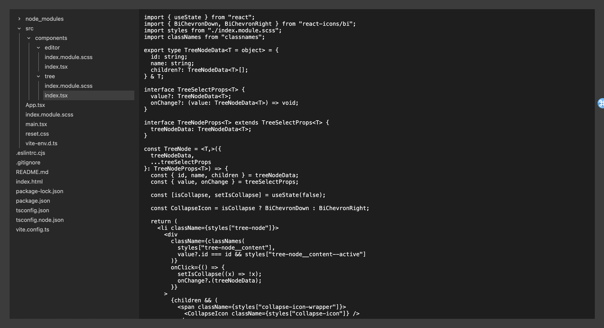

## My VSCode
A simple text editor running in browser.

#### Run
`npm i && npm run dev`

#### Note
This project is implemented by [File System Api](https://developer.mozilla.org/en-US/docs/Web/API/File_System_API) that browsers like Safar may not support. Chrome is recommended.
